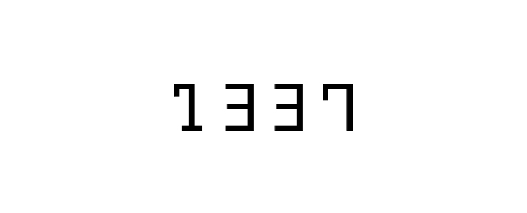
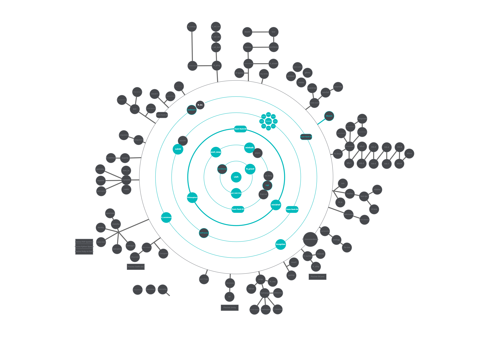

#  **1337-Projects**
All the project that i worked on in 1337 (42 network) computer science school

##  C-Projects :

<ul>
	<li><a href="./Libft">Libft</a>.</li>
	<li><a href="./Get_next_line">Get next line</a>.</li>
	<li><a href="./ft_printf">ft_printf</a>.</li>
	<li><a href="./Cube3D/">Cube3D</a>.</li>
	<li><a href="./minishell">Minishell</a>.</li>
	<li><a href="./minitalk">Minitalk</a></li>
	<li><a href="./Philosophers">Philosophers</a>.</li>
	<li><a href="./push_swap">Push swap</a>.</li>
</ul>

##  C++-Projects :

<ul>
	<li><a href="./CPP Module">CPP Module</a>.</li>
	<li><a href="./ft_containers">ft_containers</a>.</li>
</ul>

## Network & System administration :

<ul>
	<li><a href="./ft_server">ft_server</a>.</li>
	<li><a href="./Inception">Inception</a>.</li>
</ul>

## Holy Graph :
